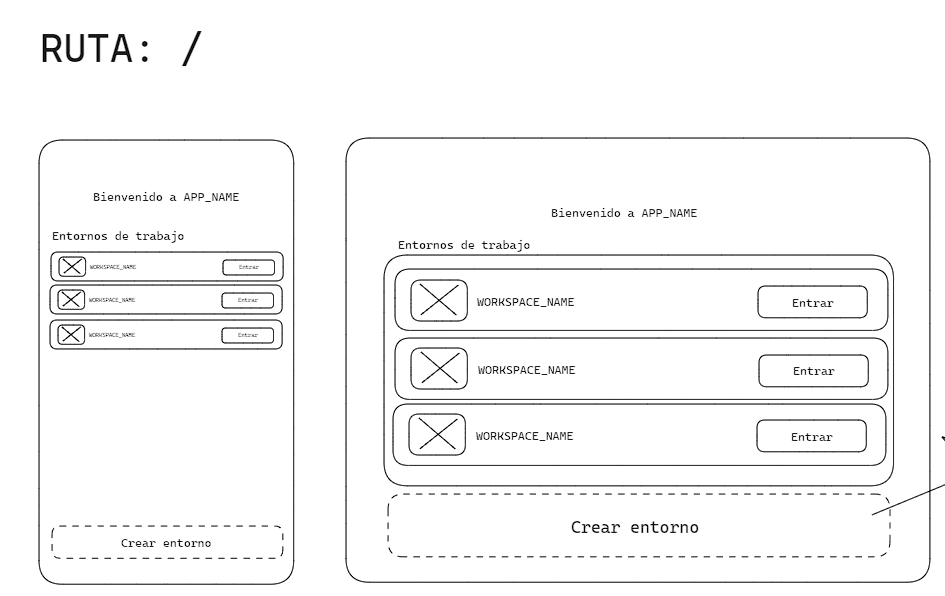
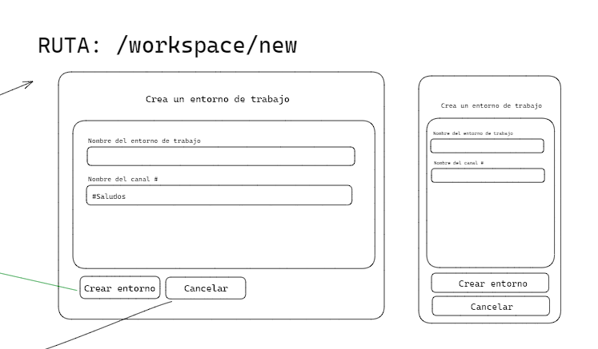
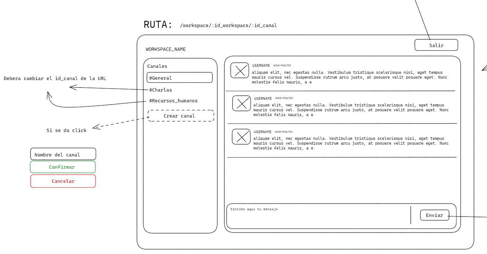
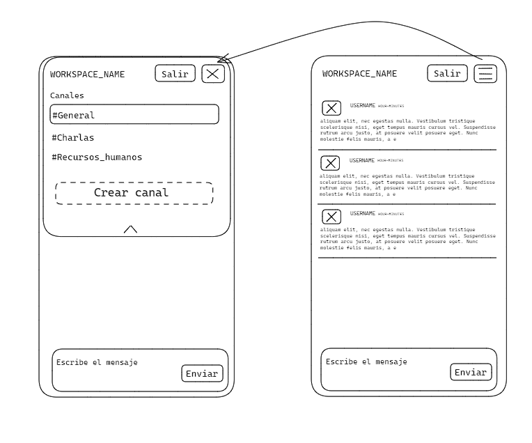

# SLACK (TP final UTN)

### Desafío elegido:
Me basé en Slack, para desarrollar una aplicacion de chat con React y React-router, que cumple con las siguientes consignas:

---
- Despliegue en vercel (o hosting de elección) funcional

- Código subido en github

- Readme.md con una descripción del desafío elegido, librerías usadas y dificultades presentadas a la hora de resolverse (opcional)

- La página debe ser totalmente responsiva de las medidas 320px a 2000px

- La página debe tener estilos accesibles acordes a los vistos en clase (fondos claros con letras claras se considera inaccesible)

- La página debe estar desarrollada en React.

- La página debe contar con el uso de estados (algún caso de useEffect)

- El enrutamiento de la página debe ser desarrollado con react-router-dom

- Debe contar con el uso de formularios

- Deben usarse componentes 

- Se debe contar con al menos 3 páginas en el flujo de la aplicación y debe usarse al menos en una los parámetros de búsqueda de react-router-dom

- Uso de localStorage o sessionStorage

- Uso de fetch para cargar información de un JSON, fake-api o alguna api pública como poke-api

- Calidad de código siguiendo los principios de la programación vistos en clase (DRY, YAGNI, KISS)

Se propone al alumno el desarrollo de la siguiente aplicación web:

